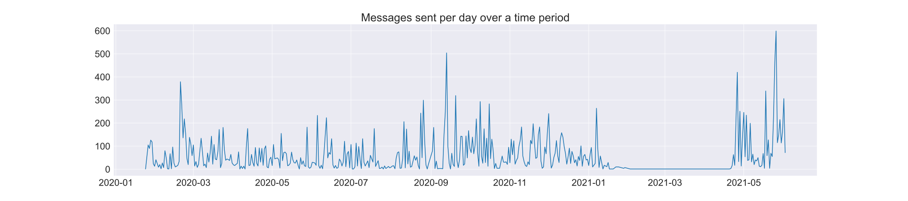
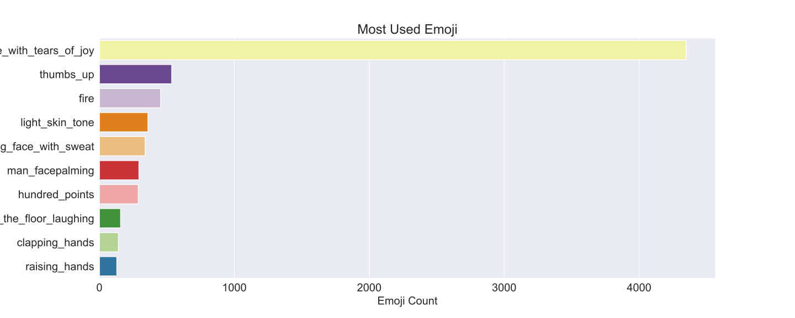

## Welcome to Whatsapp Chat Data Analysis 2.0

For the first version

-   Have a look at a **detailed [Medium Article](https://medium.com/@tusharnankani/an-exhaustive-whatsapp-chat-data-analysis-f8421a845c30)** for this project!
-   [An Exhaustive Whatsapp Chat Data Analysis - Notebook on GitHub](https://github.com/tusharnankani/whatsapp-chat-data-analysis/blob/main/whatsapp-data-analysis.ipynb)

### _Overview_

-   [Introduction](#introduction)
-   [Data Retrieval & Preprocessing](#data-retrieval--preprocessing)
-   [Exploratory Data Analysis](#exploratory-data-analysis)

    -   **[Overall frequency of total messages on the group.](#the-overall-frequency-of-total-messages-on-the-group)**
    -   **[Top 10 most active days.](#top-10-most-active-days)**
    -   **[Top 10 active users on the group (with a twist)](#top-10-active-users-on-the-group)**
    -   **[Top 10 users most sent media.](#the-top-10-users-who-send-the-most-media)**
    -   **[Top 10 most used emojis.](#top-10-most-used-emojis)**
    -   **[Most active hours and days.](#top-10-most-used-emojis)**
    -   **[Most used words - WordCloud](#most-used-words-in-the-whole-chat)**

-   [Conclusion](#conclusion)

## Introduction

-   **Data Analysis on a WhatsApp group chat** of _college students_ and find out interesting insights about _who is most active, who are ghosts (the ones who do not reply), my sleep schedule,_ \*the most used emoji, the sentiment score of each person, who swears the most, the most actives times of the day, or does the group use phones during college teaching hours?

## _Data Retrieval & Preprocessing_

Steps to get data:

-   The first step is **Data Retrieval & Preprocessing**, that is to **gather the data**. WhatsApp allows you to **export your chats** through a **.txt format**.
-   Go to the respective chat, which you want to export, and click on the three-dot menu, on the top right corner, and export your chat without media.
-   Tap on **options**, click on **More**, and **Export Chat.**

### Opening this [.txt file](whatsapp-chat-data.txt) up, you get messages in a format that looks like this:


# _Exploratory Data Analysis_

### _Importing Necessary Libraries_

We will be using :

1. **Regex (re)** to extract and manipulate strings based on specific patterns.
2. **pandas** for analysis.
3. **matlotlib** and **seaborn** for visualization.
4. **emoji** to deal with emojis.
5. **wordcloud** for the most used words.
6. **datetime** for datetime manipulation.

To read the complete process of cleaning data and preprocessing, read it [here](https://github.com/tusharnankani/whatsapp-chat-data-analysis#exploratory-data-analysis).

#### Here is how the final dataset looks like:

```
<class 'pandas.core.frame.DataFrame'>
RangeIndex: 26492 entries, 0 to 26491
Data columns (total 7 columns):
 #   Column     Non-Null Count  Dtype
---  ------     --------------  -----
 0   date_time  26492 non-null  datetime64[ns]
 1   user       26492 non-null  object
 2   message    26492 non-null  object
 3   day        26492 non-null  object
 4   month      26492 non-null  object
 5   year       26492 non-null  int64
 6   date       26492 non-null  object
dtypes: datetime64[ns](1), int64(1), object(5)
memory usage: 1.4+ MB
```

### The dataset now contains 7 rows, and 26492 respective entries.


Now that we have a clean DataFrame to work with, it's time to perform analysis on it. **Let's start Visualizing!**

# _Exploratory Data Analysis_

At this point, I think I'm ready to start my analysis so I will plot a simple line graph to see the frequency of messages over the months.

## The overall frequency of total messages on the group

<p align="center">

</p>

This is interesting, thanks to WhatsApp Updates of Privacy Policy, there was dead decline for a few months straight, since we moved to Telegram.

## Top 10 Most Active Days

Grouping the data set by date and sorting values according to the number of messages per day.

<p align="center">

</p>

-   On 26th May 2021, we had about 600 messages, also if we notice, the third place - 25th May 2021, so this was a record overall, since we started the conversation with discussing some tricky CSS and JavaScript Questions, followed by Google I/O 2021 discussion.
-   Apparently, we broke our previous record of 13th September’20 because we were discussing fundamental yet tricky and brain-wracking “Guess the Output” Java questions!

## Top 10 active users on the group

Before analyzing, the top users, let's find out how many ghosts are there in the group!

```
Total number of people who have sent at least one message on the group are 188
Number of people who haven't sent even a single message on the group are 69
```

Total number of people who have sent at least one message on the group are **188**.

-   BUT, the total number of participants were **257**.
-   That means 69 people in the group have not sent even a single message throughout these months and around 30000 messages.

But that isn't always true to make some solid facts about the analysis, doesn't **necessarily** mean they are not reading the chats.

As some wise people said:

> A lot of people want to know what's being talked about but don't have something to say about what's being talked about

> Kuch logo ko itna knowledge hi nahi hai and are learning from others

And there is something called `passive participation`, and that was the very reason that I suggested to move back to WhatsApp from Telegram, so that a lot more people can be a part of the family.

### Now, looking top 10 active users.

_Replacing names with initials for better visualization_

**My first plot will be the total number of messages sent per person.** For this, a simple _seaborn countplot_ will suffice.

<p align="center">

</p>

**TK** still killing everyone by a mile, with **5000+ messages**, followed by **DL** with around **4000 messages**.


#### But here comes the twist!

Now, I will plot the **Average Message Length of the messages sent by the Top 10 most active users**. _Let''s see the results now!_

### _Comparing the top 10 users!_

Now, first things first, since almost all the plots will be _comparing one person with another_, I’ll assign a **specific color to each person** so that it becomes **easy to identify each person among multiple plots**.

I'm defining a function **_to maintain consistent colors for each person across all plots_**. Since the order will vary depending on the plot, this is passed to the function which will _reorder colors in a particular order so that the color of a certain person remains the same no matter the plot_. This will help maintain **_consistency and readability_** amongst the many graphs I will be plotting.

#### Let's see the plots, simultaneously for **some interesting results**!

-   **Plotting multiple charts in a grid**

<p align="center">

</p>

It's really interesting to see plots like this side by side, because here comes the twist:

-   Ironically, TK, the person who sent the **most amount of texts** (5000+), has the less messages’ length on average. This means this person sends broken and many WhatsApp messages in one go.

> Things aren't always the way they seem like.

-   Also, like last time, we can see that, I have sent _less number of messages (8th) on average_ while having a **_relatively longer message length (1st)_**, rather haveing a greater message **depth.**

Not bragging, just presenting the facts 👀️

## The Top 10 users who send the most media

<p align="center">

</p>

**TK and DL** are still beating everyone by a _huge margin_.

## Top 10 most used Emojis

Will be using the `emoji` module, that was imported earlier.

-   Will create another helper column using `emoji.demojize("<emoji>")`, since **emojis will not be rendered in the plots**.

Since the emojis **will not be rendered into the plots**, here is how the _top10emojis dataset looks like_!


### Which Emoji is the most used in the chat?

<p align="center">

</p>

## Most active days, most active hours, most active months.

#### Which hour of the day are most messages exchanged?

<p align="center">

</p>

### Visualization

Now, we will be plotting **_grouped by day and respective group by month simultaneously_**, to see some interesting results.

<p align="center">

</p>

Inferences:

-   There is a very interesting peak in May, which can be answered if we look over the timeline over the period.
    -   The group was created in Jan 2020, and by 2021 beginning, the group was closed.
    -   And it was reopened, in May 2021.
    -   So, the chats contain 2020 and May 2021 chats, hence the peak.
-   Also, we are pretty much active around the whole week.

To get a clearer understanding, we will plot a combined graph — **Heatmap**.

#### Now, we will plot a heatmap, combining the above to bar plots, for a better understanding!

### Heatmap of Month sent and Day sent

<p align="center">

</p>

-   The heatmap just proves our previous observations, about May being very active.
-   We can also see more lighter shades on Sundays, which wasn't really evident in the previous plot.

## Most Used Words in the whole chat.

I will be using the `wordcloud` module, to create a WordCloud of the **most used words**!


# _Conclusion_

That's it from my end! Did this in the middle of my sem exams, but it was worth it!

<p align="center"><iframe src="https://giphy.com/embed/RJVetygOqfw9hY8mEN" width="480" height="270" frameBorder="0" class="giphy-embed" allowFullScreen></iframe><p align="center"><a href="https://giphy.com/gifs/brooklynninenine-season-7-brooklyn-99-b99-RJVetygOqfw9hY8mEN">via GIPHY</a></p></p>

If you find something interesting throughout the analysis, feel free to make a PR! 🎉️

It's really interesting to see the texting habits of people and incidents of daily life reflected in the text. I suggest you take a look at my code and apply it to your own group chats. However, some modifications will have to be done at the DataFrame creation part.

If you're interested, shoot me a message and I'll help you out.

# Author

Tushar Nankani

-   [LinkedIn](https://www.linkedin.com/in/tusharnankani/) | [Twitter](https://twitter.com/tusharnankanii)
